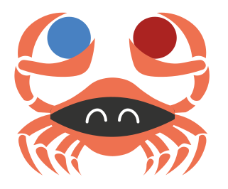

Parasect
========

.. badges-begin

|PyPI| |Status| |Python Version| |License|

|Read the Docs| |Tests| |Codecov|

|pre-commit| |Black|

.. |PyPI| image:: https://img.shields.io/pypi/v/parasect.svg
   :target: https://pypi.org/project/parasect/
   :alt: PyPI
.. |Status| image:: https://img.shields.io/pypi/status/parasect.svg
   :target: https://pypi.org/project/parasect/
   :alt: Status
.. |Python Version| image:: https://img.shields.io/pypi/pyversions/parasect
   :target: https://pypi.org/project/parasect
   :alt: Python Version
.. |License| image:: https://img.shields.io/github/license/AvyFly/parasect
   :target: https://opensource.org/licenses/MIT
   :alt: License
.. |Read the Docs| image:: https://img.shields.io/readthedocs/parasect/latest.svg?label=Read%20the%20Docs
   :target: https://parasect.readthedocs.io/
   :alt: Read the documentation at https://parasect.readthedocs.io/
.. |Tests| image:: https://github.com/AvyFly/parasect/workflows/Tests/badge.svg
   :target: https://github.com/AvyFly/parasect/actions?workflow=Tests
   :alt: Tests
.. |Codecov| image:: https://codecov.io/gh/AvyFly/parasect/branch/master/graph/badge.svg
   :target: https://codecov.io/gh/AvyFly/parasect
   :alt: Codecov
.. |pre-commit| image:: https://img.shields.io/badge/pre--commit-enabled-brightgreen?logo=pre-commit&logoColor=white
   :target: https://github.com/pre-commit/pre-commit
   :alt: pre-commit
.. |Black| image:: https://img.shields.io/badge/code%20style-black-000000.svg
   :target: https://github.com/psf/black
   :alt: Black

.. badges-end

.. logo-end

Welcome to *Parasect*, a utility for manipulating parameter sets for autopilots!

Features
--------

*Parasect* has two-fold capabilities:

1. Compare two parameter sets and highlighting their differences.
2. Parsing from user-defined content and generating new parameter sets, ready for loading into an autopilot.

List of currently supported autopilots:

* Ardupilot_
* PX4_

Requirements
------------

*Parasect* is a pure-Python project. Its requirements are managed by the Poetry_ dependency manager.
When you install *Parasect* via pip_ its requirements will also be installed automatically.

Currently *Parasect* has been tested:

* in Continuous Integration servers for **Ubuntu Linux**, **Windows**
* manually in **Ubuntu Linux**.

Installation
------------

You can install *Parasect* via pip_ from PyPI_:

.. code:: console

   $ pip install parasect

If you don't care about using *Parasect* as a library and are only interested in
command-line use, you can also use `pipx`_, that provides better isolation from
the rest of the system:

.. code:: console

   $ pipx install parasect

Usage
-----

*Parasect* is primarily used as a command-line program.
In its simplest form, two parameter files can be compared via:

.. code:: console

   $ parasect compare <FILE_1> <FILE_2>

The usage for building parameter sets is more involved.
Please see the `Command-line Reference <CLI usage_>`_ for details.

Additionally, it exposes a minimal API, enabling automated operations.
This is described in the `API Reference <API usage_>`_.

It is strongly recommended that you read the Concepts_ that *Parasect* employs, if you plan to make full use of it.

Contributing
------------

Contributions are very welcome.
To learn more, see the `Contributor Guide`_.

License
-------

Distributed under the terms of the `MIT license`_,
*Parasect* is free and open source software.

Issues
------

If you encounter any problems,
please `file an issue`_ along with a detailed description.

Credits
-------

This project was sponsored by `Avy B.V. <Avy_>`_, a UAV company in Amsterdam.

This project was generated from `@cjolowicz`_'s `Hypermodern Python Cookiecutter`_ template.

The project logo was created by `Cynthia de Vries <Cynthia_>`_.

.. _@cjolowicz: https://github.com/cjolowicz
.. _Cynthia: https://www.linkedin.com/in/cynthia-de-vries-497991231/
.. _Cookiecutter: https://github.com/audreyr/cookiecutter
.. _MIT license: https://opensource.org/licenses/MIT
.. _PyPI: https://pypi.org/
.. _Hypermodern Python Cookiecutter: https://github.com/cjolowicz/cookiecutter-hypermodern-python
.. _file an issue: https://github.com/AvyFly/parasect/issues
.. _pip: https://pip.pypa.io/
.. _pipx: https://github.com/pypa/pipx
.. _CLI usage: https://parasect.readthedocs.io/en/latest/reference.html#cli-reference
.. _API usage: https://parasect.readthedocs.io/en/latest/reference.html#api-reference
.. _Concepts: https://parasect.readthedocs.io/en/latest/concepts.html
.. _PX4: https://px4.io/
.. _Ardupilot: https://ardupilot.org/
.. _Poetry: https://python-poetry.org/
.. _Avy: https://avy.eu
.. github-only
.. _Contributor Guide: CONTRIBUTING.rst
